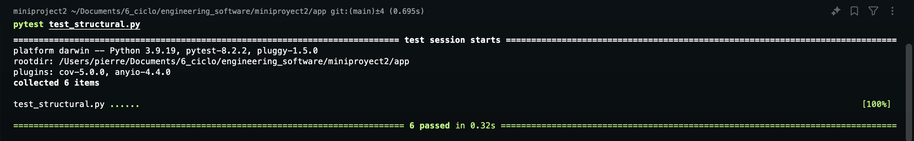
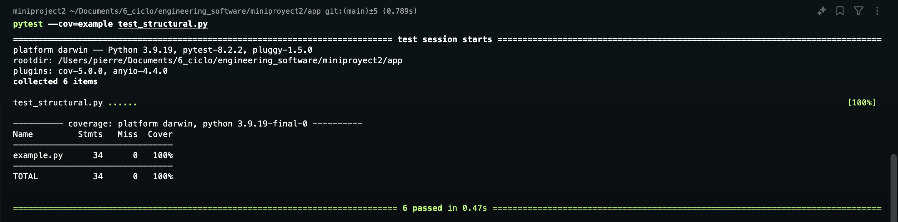
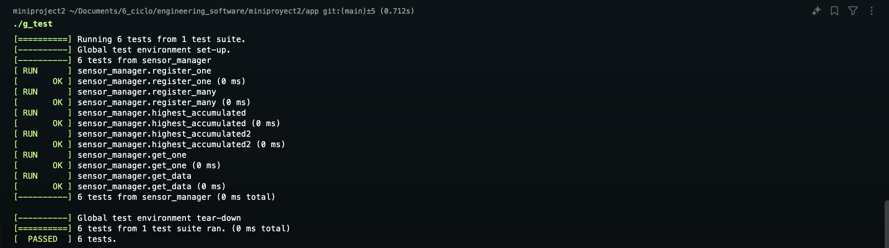
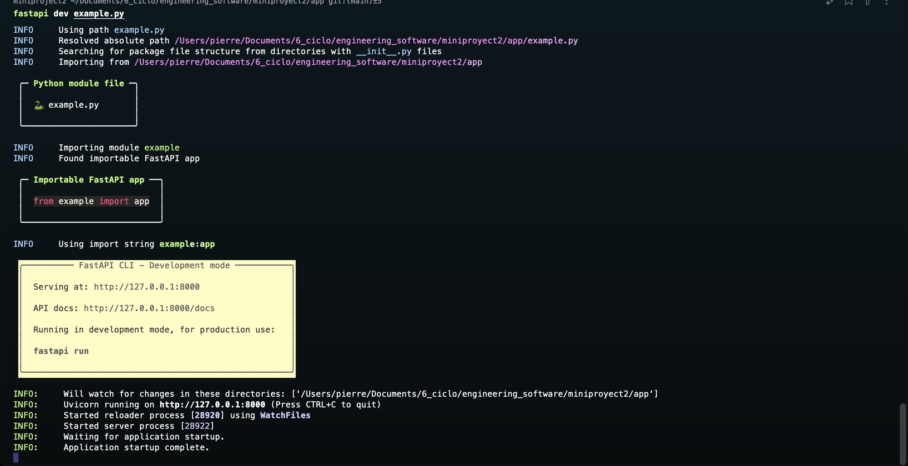
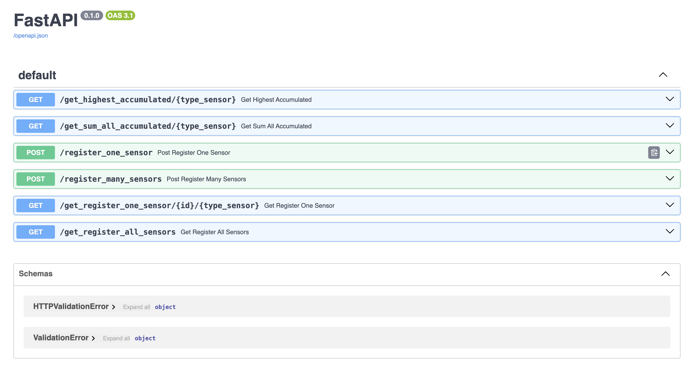
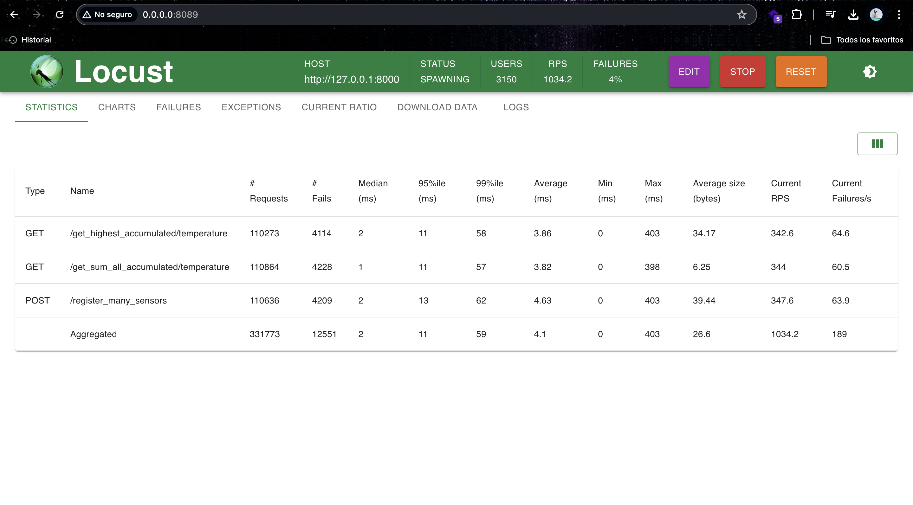

# TDD2

Miniproyecto 2

Este proyecto del curso de Ingenieria de software nos ayuda a entender el concepto de TDD en c++ con el uso de gtest y su interaccion con python con el uso de pybind11 ademas de la creacion de una API con FastAPI para la interaccion con el usuario.

## Guia para ejecutar el proyecto en local

### Requisitos

-   Tener instalado python 3.8
-   Tener instalado pip
-   Tener instalado git

### Pasos

1. Clonar el repositorio

```bash
git clone https://github.com/Jerimy2021/TDD2.git
```

2. Ingresar al directorio del proyecto

```bash
cd app
```

3. Crear un entorno virtual

```bash
python -m venv miniproyecto2
```

4. Activar el entorno virtual

```bash
source miniproyecto2/bin/activate
```

5. Instalar las dependencias

```bash
pip install -r requirements.txt
```

6. Ejecutar el proyecto

```bash
fastapi dev example.py
```

### Documentación

#### Test

Para ejecutar los test en python debemos ejecutar el siguiente comando.

```bash
pytest test_structural.py
```

Debemos tener esta imagen en la terminal


Mientras para visualizar el pytest coverage debemos ejecutar el siguiente comando.

```bash
pytest --cov=example test_structural.py
```

Debemos tener esta imagen en la terminal


Por ultimo para visualizar el test de c++ de gtest debemos compilar el proyecto con el siguiente comando.

```bash
g++ -std=c++17 -lgtest -lgtest_main -pthread' sample.cpp -o g_test
```

Debemos tener esta imagen en la terminal


Si tiene problemas en ejecutar el gtest comente las librerias de la linea 5 y 6 de pybind11 y la ultima parte de la linea 83 hacia adelante el problema podria estar relacionado con que el sistema operativo no reconoce su pybind11 a pesar de estar instalado.

Como vemos obtenemos un perfecto coverage en el pytest del proyecto.

#### API

Para visualizar la documentacion de la API debemos ingresar a la siguiente direccion en nuestro navegador.

```bash
fastapi dev example.py
```

obtendremos la siguiente imagen en nuestro navegador



Del mismo modo podemos verificar el strees test de la API con el siguiente comando.

```bash
locust -f locustfile.py
```

Yo realize un streest test con varios usuarios y obtuve el siguiente resultado.

